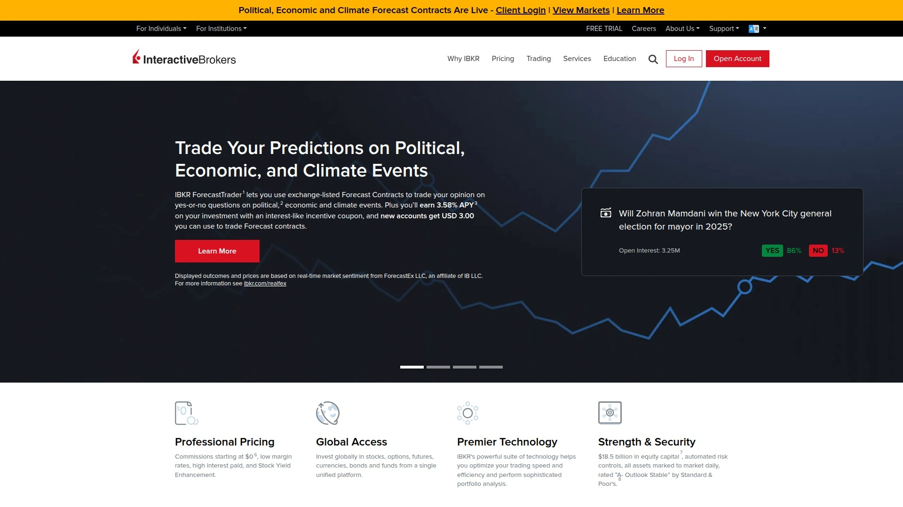

# 2025年十八大最佳加密货币交易所排行榜(深度整理)

加密货币交易最让人纠结的,就是不知道该选哪个平台,担心安全性、手续费太高、交易对太少、提现困难。专业的加密货币交易所能提供500多个交易对、最低0%手续费、100倍杠杆期货交易,以及现货、合约、质押等全方位服务,让你在一个平台就能完成从法币入金到衍生品交易的所有操作。无论是追求低费率的高频交易者,还是希望简单买卖比特币的新手,这份榜单覆盖中心化交易所、期货合约平台、多币种交易等多种类型,帮助你找到最适合交易习惯和资产规模的解决方案。

## **[Poloniex](https://www.poloniex.com)**

全球信赖的加密货币交易所,超过500个交易对和行业最低手续费。

Poloniex由Tristan D'Agosta于2013年初创立,是加密货币领域的老牌交易平台,2019年从母公司Circle剥离后成立Polo Digital Assets公司独立运营。2022年获得Justin Sun(波场创始人)支持,成为全球领先的中心化交易所。

**交易产品线**涵盖现货交易、保证金交易、期货交易和永续合约,满足从新手到专业交易者的全部需求。现货交易支持超过500个交易对,包括70多个澳元交易对,用户可以用银行账户、信用卡或借记卡以及ApplePay购买350多种加密货币和代币。期货交易提供比特币、以太坊、波场等8种以上加密资产的永续合约,杠杆最高可达100倍。

**费率结构**采用分层模式,基于30天交易量计算,Maker/Taker费率从0.2%/0.2%起步,交易量达到5000万美元以上时Maker费率可降至-0.005%(负费率意味着做市商获得返还),Taker费率降至0.1%。保证金交易支持最高10倍杠杆,期货交易最高125倍杠杆,为专业交易者提供充分的资金利用效率。

**特色功能**包括DeFi创新区,交易85种以上DeFi资产和杠杆代币。质押服务让用户持有波场、Cosmos等币种即可获得定期收益,操作简化无需复杂配置。TrollBox是Poloniex著名的社区聊天室,交易者可以在这里讨论市场动态、参与交易竞赛等活动。移动应用支持iOS和Android,随时管理余额和交易,实时监控所有市场行情,设置价格提醒永不错过交易机会。

平台提供24/7全天候客户支持,通过工单系统和实时聊天功能快速响应用户问题。安全措施包括冷存储、多重签名钱包和风控系统。在CoinMarketCap上24小时交易量超过13亿美元,总资产约4740万美元。适合追求低费率、高杠杆和多样化交易产品的全球用户。

## **[Binance](https://www.binance.com)**

全球交易量最大的加密货币交易所,支持400多种币种和最低交易费。

Binance成立于2017年,总部位于开曼群岛(全球版)和美国(Binance US版)。在全球加密货币交易所中交易量排名第一,特别擅长山寨币交易,支持的币种数量全球领先。

核心优势在于极低的交易费率,标准费率为0%-0.6%,高交易量用户可享受更多折扣。产品矩阵包括现货交易、期货合约、保证金交易、质押、流动性挖矿、Launchpad新币发行等,涵盖零售用户到机构客户的全方位需求。Binance US受限于监管,支持的币种约150种,而全球版支持400多种。

**高级功能**涵盖从新手到专家的各个层级。质押、保证金交易、期货交易(符合条件的地区)、NFT市场、API和专业工具一应俱全。平台在美国面临监管挑战,通过Binance US运营受限版本,全球用户可使用完整功能。

**优缺点对比**显示,最大优势是交易费率最低、币种选择最多、适合全球活跃交易者。劣势是在美国面临监管问题,Binance US功能受限。Kraken用户常因安全性和高级功能选择Kraken而非Binance,但Binance的全球流动性和产品多样性无可匹敌。适合追求最低成本、最多币种选择、高频交易的用户。

## **[Coinbase](https://www.coinbase.com)**

美国上市公司旗下交易所,新手友好度最高的监管合规平台。

Coinbase成立于2012年,总部位于美国,是纳斯达克上市的公开公司,受到严格监管。在100多个国家运营,美国大部分州都有牌照,监管透明度行业领先。

**新手友好设计**是Coinbase的最大卖点,界面简洁直观,提供丰富的教育资源和学习奖励,用户完成课程可获得加密货币奖励。Coinbase支持290多种加密货币,虽不及Binance但持续扩充。Coinbase Advanced是面向资深交易者的高级界面,提供更多订单类型和专业工具。

费率是Coinbase的弱项,标准费率0%-3.99%取决于交易方式,比Binance和Kraken略高。但平台通过PayPal集成、银行转账、信用卡支付等多元化入金方式弥补这一不足。质押功能支持多种币种,用户可以轻松获得被动收益。

**优缺点权衡**中,最大优势是新手最易上手、高度监管合规、上市公司背景提供信任保障。劣势是费率较高、高级功能需切换到Advanced界面。Kaiko交易所排名显示Coinbase在Q3 2025排名第3,Crypto.com第2,Kraken第1。适合初次接触加密货币、重视安全合规、愿意为便捷性支付略高费用的用户。

## **[Kraken](https://www.kraken.com)**

安全性和高级工具双强的专业交易平台,支持410多种币种。

Kraken成立于2011年,总部位于美国旧金山,是业内运营时间最长的交易所之一。在190多个国家和美国大部分州运营,全球监管合规。

**安全措施**极为严格,经过多轮安全审计,实施双因素认证和PGP邮件加密,从未发生重大安全事故,在最安全交易所榜单中排名第一。Kraken Pro提供强大的专业交易平台,支持现货交易、保证金交易(符合条件用户)、期货交易和质押。

交易费率0%-0.4%,基于30天交易量分层计算,对高频交易者极为友好。Kraken支持410多种资产,与Binance不相上下,且在机构和高级零售交易者中享有盛誉。质押和期货功能面向符合条件的用户开放,提供最高5倍杠杆的保证金交易。

**为何选Kraken而非Binance**的原因包括卓越安全性、质押和期货适合专业用户、Pro工具和机构级服务。Pro平台可能让新手感到复杂,部分资产和产品在美国受限。Kaiko排名显示Kraken在Q3 2025排名第1,领先Crypto.com和Coinbase。支持PayPal、银行转账、信用卡等多种支付方式。适合重视安全、需要高级交易功能、机构和专业散户交易者。

## **[OKX](https://www.okx.com)**

专注高级交易者的全能型交易所,统一账户和Web3钱包无缝集成。

OKX是专为高级交易者设计的平台,提供现货、保证金和衍生品交易,通过移动端和网页端访问。OKX率先推出统一账户功能,允许用户在单一账户中整合资金,跨现货、期货、期权等产品使用。

**交易产品**涵盖现货交易支持80多种加密货币和170个交易对(包括70个澳元交易对),界面直观适合新手也满足资深交易者需求。衍生品交易提供期货、永续合约和期权(符合条件的批发客户),支持更复杂的交易策略和风险管理。演示交易模式让新用户用模拟资金练习策略,零风险积累经验。

**Web3生态整合**是OKX的独特优势,自托管钱包支持130多条原生区块链,用户通过种子短语或私钥完全控制资产。Smart Account功能基于账户抽象,允许用户用USDC或USDT等稳定币支付Gas费,无需持有链原生代币。OKX DEX聚合器使用X Routing算法,跨数百个DEX和20多个跨链桥寻找最优价格,减少滑点和费用。

Jumpstart提供代币发行活动,包括Mining(质押指定资产获得奖励)和On Sale(折扣价购买)。NFT市场跨21条链运营,包括以太坊、Solana、Polygon、BNB Chain等,支持Ordinals中心进行BRC-20/比特币NFT交易。在24小时交易量排名中常位列全球前五。适合追求高级工具、DeFi和NFT整合的活跃交易者。

## **[Bybit](https://www.bybit.com)**

迪拜总部的衍生品交易专家,7000万用户的全球化平台。

Bybit由新加坡企业家Ben Zhou于2018年创立,2022年将总部从新加坡迁至阿联酋迪拜,是全球最大的加密货币交易所之一。截至2025年,Bybit服务超过7000万交易者。

**核心产品**包括即时加密货币交易,支持用信用卡、银行转账或其他支付方式即时交易比特币、以太坊、Ripple、Solana、PEPE等主流币。现货和衍生品交易的用户体验经过优化,使交易比特币、以太坊等加密货币比以往更轻松。无缝存款和转账功能支持在多个钱包间快速转移主流加密货币,提供完整定制选项。

**投资组合多元化**工具让用户在现货或衍生品市场交易,提供杠杆代币、加密贷款和保证金交易。跟单交易是Bybit首创功能,允许投资者免费跟随精英交易者,自动复制其交易策略并像专业人士一样获利,支持期货/现货/策略跟单。

**2025年安全事件**需要注意,2月21日Bybit遭受黑客攻击,约40万以太坊被盗,价值约14亿美元,创下加密货币交易所被盗纪录。Bybit在72小时内通过Galaxy Digital、FalconX和Wintermute等机构的紧急融资,补充了44.7万枚以太坊恢复储备。区块链分析公司Arkham Intelligence和Elliptic将攻击归因于朝鲜Lazarus Group。尽管事件已解决,但提醒用户重视平台安全历史。

Coindesk报道显示,零售主导的Bybit现已成为比CME更大的比特币期货交易所。适合追求衍生品交易、跟单功能和全球化服务的用户,但需关注平台安全记录。

## **[KuCoin](https://www.kucoin.com)**

支持900多种数字资产的综合交易平台,自动化交易机器人丰富。

KuCoin成立于2017年,最初在中国创立,后因中国政府政策迁至新加坡,现总部位于塞舌尔。平台支持超过900种数字资产交易,提供现货、期货和期权交易,以及自动化交易机器人和质押服务。

**交易功能**直观易用,新手和专业人士都能轻松上手。现货交易支持基础买入卖出,保证金交易支持最高10倍杠杆。衍生品期货交易支持最高125倍杠杆(精选资产),期权交易传达杠杆概念(保费与名义价值比率)。

**KuCoin Token (KCS)** 是平台原生代币,实时价格约13.97美元,24小时交易量超1160万美元。持有KCS可享受交易费折扣和其他平台权益。平台总储备超28亿美元,其中包括6050万KCS(价值8.44亿美元)、4.6亿USDT、2554.7 BTC(价值2.79亿美元)、24亿UXLINK(价值2.76亿美元)、5.1万ETH(价值2亿美元)等。

订单类型包括市价单、限价单和止损单。限价单可设定期望价格,买入时设定低于市价或卖出时设定高于市价,订单将等待成交。所有交易信息、价格、取消和编辑操作都在交易界面右侧显示。适合追求多样化资产选择、自动化交易工具和灵活杠杆的用户。

## **[Gate.io](https://www.gate.com)**

3800多种加密货币的全球交易所,0.2%现货费率和创新功能。

Gate.io由Lin Han于2013年创立,最初在中国以Bter.com名称运营,2017年更名为Gate.io以服务全球用户,总部位于开曼群岛乔治敦。截至2025年3月,Gate.io在全球加密货币交易所中排名前列,提供超过3800种加密货币和稳定币交易。

**交易量和覆盖**方面,2025年3月14日的24小时交易量约27.5亿美元,反映其在加密市场的重要地位。平台在全球130多个国家运营,但在美国、加拿大等地区因用户协议限制不可用。支持4100万用户,拥有12年运营经验。

**费率结构**极具竞争力,现货交易对所有交易采用0.2%的固定费率(Maker和Taker)。持有平台原生代币GT或达到更高交易量可获得折扣。期货交易采用基于VIP等级的分层费率,标准用户(VIP 0)基础费率为Maker 0.020%、Taker 0.050%,可通过升级VIP或使用Gate.io积分系统(1积分=1 USDT交易费减免)进一步降低。提现费用因币种而异,存款不收费。

**特色活动**包括2025年1月1日至3月31日期间,通过BEP20(BSC)网络提现至少20单位USDT、USDC和FDUSD享受零提现费。Gate Alpha是领先的链上资产交易平台,整合CEX和DEX优势,一键访问跨链资产,代币覆盖最广,上币速度达到分钟级。用户持有和交易可赚取Alpha积分,用于代币空投、TGE订阅和限时活动。

产品线涵盖现货交易(热门资产、代币和币种如TON、SOL、MEME、BRC20、AI、Layer2等)、期货交易(永续和交割合约,新用户享零手续费和专属工具)、NFT、质押、加密贷款和Gate Pay。适合追求极多币种选择、低费率和创新产品的全球用户。

## **[HTX](https://www.htx.com)**

原Huobi交易所,支持700多种虚拟资产的综合区块链生态。

HTX前身是Huobi,由李林于2013年在北京创立,李林毕业于清华大学自动化专业,曾在Oracle担任计算机工程师。2022年9月Huobi Global更名为HTX。根据Bloomberg报道,HTX由加密货币亿万富翁Justin Sun拥有。

**生态系统布局**涵盖数字资产交易、金融衍生品、钱包、研究、投资、孵化等区块链业务。服务客户包括机构、做市商、经纪商和个人用户,遍布五大洲160多个国家。平台支持超过700种虚拟资产,日交易量超40亿美元,注册用户超4500万。

**交易产品**包括现货交易、期货交易、保证金交易、理财产品、托管服务、交易机器人等,7天24小时通过多个渠道联系支持服务。HTX的愿景是"为地球80亿人实现财务自由",作为Web3世界领先门户,其增长战略"全球扩张、繁荣生态、财富效应、安全与合规"支撑其为全球虚拟资产爱好者提供优质服务和价值的承诺。

**平台原生代币HTX**在Huobi生态内发挥多种作用,包括降低交易费、参与代币销售、访问专属功能。用户使用HTX支付交易费可享受折扣。HTX支持与众多加密货币交易对,增强流动性并提供多样化交易机会。社区参与通过治理机制鼓励,HTX持有者可影响平台发展决策。

2017年中国政府禁止比特币交易所后,Huobi停止比特币提现,Huobi中国继续作为区块链咨询和研究平台运营。2018年3月Huobi日处理交易量约10亿美元。24小时交易量约39亿美元,总资产约51亿美元。适合追求综合生态系统、多样化产品和全球化服务的用户。

## **[Crypto.com](https://crypto.com)**

新加坡中心化交易所,美国市场新启动的竞争力平台。

Crypto.com Exchange是全球领先的加密货币交易平台之一,提供超过300种加密货币和480个交易对。2025年9月宣布在美国启动,为美国用户提供行业领先的安全和合规功能。

**交易界面**针对速度和响应性优化,基于小部件的设计完全可定制,用户可轻松拖放图表和订单簿等元素,实现个性化交易体验。面向活跃交易者的关键功能包括高级订单类型和子账户创建用于投资组合管理,被动用户可使用DCA、GRID和TWAP等强大交易机器人实施策略。

**入金和提现**方面,用户可通过本地银行账户的直接Fedwire转账为Crypto.com Exchange账户充值。通过平台上的"USD"捆绑余额,客户可灵活提现美元或USDC(稳定币),按1:1比例无需转换费或价差。机构客户受益于通过CUBIX的即时转账、OTC交易服务,支持FIX 4.4、WebSockets和REST API,提供超低延迟交易体验。

**费率优势**明显,Maker费率低至0%,用户还可通过其他操作享受更多激励,使其成为相比其他美国本土交易所更具竞争力和成本效益的交易场所。在全球现货交易交易所中排名前三,去年夏天成为全球第一大支持美元的加密货币交易所,BTC和ETH交易价差最紧。

Crypto.com支持313种加密货币,费率0%-2.99%取决于交易方式,支持银行转账、信用卡和Crypto.com Pay支付。Market Maker和VIP计划提供独家费用激励、行业活动访问、专业市场洞察和24/7定制客户支持。Kaiko排名显示Crypto.com在Q3 2025排名第2,仅次于Kraken。适合追求美国合规、低费率和机构级服务的用户。

## **[Gemini](https://www.gemini.com)**

纽约金融服务局监管的安全第一交易所,机构投资者首选。

Gemini在美国加密货币交易所中以合规性和安全性著称,被认为是最合规和最注重安全的平台之一,是2025年机构投资者和重视监管透明度用户的首选。

**监管和安全**方面,Gemini受纽约金融服务局(NYDFS)监管,遵守严格的合规标准。采用冷存储和保险支持的托管增强安全性,行业领先的安全协议包括双因素认证(2FA)。Gemini在最安全加密货币交易所榜单中排名第3,仅次于Kraken和Coinbase。

**产品套件**全面,包括现货交易、质押、带奖励的加密信用卡、高收益账户(受监管限制)。用户友好的移动应用和安全托管解决方案同时满足零售和机构客户需求。用户可交易不同市值的加密货币,获得既有和新兴数字资产的访问权。

Gemini Earn允许用户在持有的加密资产上产生收益(受监管限制),Gemini信用卡在购买时提供加密货币奖励。支持73种加密货币,费率0.5%-3.49%取决于交易方式,支持银行转账和信用卡支付。费率结构具有竞争力,高交易量交易者可享受折扣。

Kaiko排名显示Gemini在Q3 2025排名第4。适合用户和机构寻求顶级安全性和监管保证,对于重视资产保护和透明度的投资者而言是理想选择。

## **[Bitfinex](https://www.bitfinex.com)**

运营时间最长的专业交易平台,机构和高级交易者的深度流动性首选。

Bitfinex成立于2012年,是最古老的加密货币交易所之一,由香港iFinex Inc公司运营。iFinex Inc还拥有市值最大的稳定币Tether (USDT)。平台专为专业交易者和机构设计,支持法币和加密货币。

**流动性优势**体现在BTC交易对和其他主流山寨币如ETH、XMR的流动性被认为是行业最深的。为保护用户资产,平台提供双因素认证和IP地址监控。专注于有经验的专业交易者和投资者,提供保证金借贷、保证金融资、配对交易、场外交易(OTC)等功能。

**产品线**除现货和保证金交易外,还包括Bitfinex Borrow(借贷)、Bitfinex Pay(支付)、Bitfinex Pulse(社交)、API和原生实用代币UNUS SED LEO。保证金交易支持高杠杆,期货交易可用。

**费用和限制**方面,法币最低存取款额度为USD/EUR/GBP 10,000、JPY 1,000,000、CNH 75,000。法币提现费用较高。24小时交易量约1.93亿美元,总资产约260亿美元。

**安全历史**需关注,交易所曾两次被黑客攻击,2016年的第二次攻击是行业有史以来最大的黑客攻击之一,损失超过6000万美元比特币。交易所存储的资产没有保险。不支持美国客户。适合需要深度流动性、高杠杆保证金交易和OTC服务的专业交易者和机构,但需考虑其安全历史。

## **[MEXC](https://www.mexc.com)**

3000多个交易对的全球交易所,零手续费和早期代币上市优势。

MEXC成立于2018年,将自己定位为"您通往加密货币的最简单方式"。在170多个国家和地区拥有超过4000万用户,提供安全便捷的平台,可交易3000多种加密货币、提前接触热门代币、享受每日空投和极低费率。

**交易产品**提供高级交易基础设施、行业领先的订单执行和强大的产品多样性,包括现货、期货、保证金交易、ETF产品、质押和Launchpad。MEXC因率先上市新兴代币而广受认可,为用户提供竞争优势。

**费率结构**极具吸引力,标准现货交易费为0% Maker费和0.05% Taker费(常在活动期间或使用费用抵扣时进一步降低)。期货交易费为0.00% Maker费和0.01% Taker费(可能因地区而异)。此外MEXC在精选交易对上提供零费用促销、MX代币持有者和VIP用户享受折扣费率。提现费和交易费因资产和网络状况而异。

**安全保障**方面,MEXC执行严格保障措施,包括每两个月更新一次储备证明,主要加密货币的储备比率超过100%。保险基金账户已提供超过5.26亿美元,用于覆盖用户清算期间损失超过可用保证金时的赤字。

MEXC通过3亿美元生态发展基金和IgniteX计划(3000万美元CSR项目致力于培养Web3人才)推动行业增长。比特币披萨日庆祝活动和教育计划等社区活动强化其对全球区块链采用的承诺。24小时交易量约57.5亿美元,总资产约54亿美元。

**Reddit社区反馈**显示MEXC存在争议,有用户指控其禁止盈利交易者并扣留资金。适合追求最多交易对、极低费率和早期代币上市的用户,但需关注社区风险反馈。

## **[Bitget](https://www.bitget.com)**

全球最大跟单交易平台,1亿用户信赖的Web3公司。

Bitget成立于2018年,是全球领先的加密货币交易所和Web3公司,在150多个国家和地区为超过1亿用户提供服务。平台核心定位是跟单交易领导者,用户可跟随精英交易者免费复制其交易订单。

**跟单交易创新**是Bitget的最大卖点,作为首家发布跟单交易的加密货币交易所,投资者可免费跟随精英交易者并像专业人士一样自动获利。支持期货/现货/策略跟单交易。跟单交易基于交易者的实时盈亏数据,用户可关注、复制、自动化并通过复制全球顶级交易者的交易获利,新手友好。

**交易产品**涵盖现货交易(买卖加密货币,在现货市场无缝交易,选择超过550种加密货币如比特币、以太坊、莱特币)。期货交易支持USDT-M/USDC-M/COIN-M,买入(做多)和卖出(做空)比特币、以太坊和其他加密货币。RWA期货是Bitget推出的全球首个CEX上市RWA指数永续期货,连接传统金融和加密货币,交易对如TSLAUSDT (RWA)、NVDAUSDT (RWA)和CRCLUSDT (RWA),让用户无需经纪账户、无地理限制即可直接在Bitget访问代币化股票和金融资产。

**杠杆交易**方面,Bitget为寻求杠杆的交易者提供选项,期货杠杆比率最高125倍,现货交易最高10倍,用户可放大仓位并潜在最大化利润。存款功能简便,只需复制存款地址或扫描二维码即可开始,也可用银行存款、P2P交易或第三方支付购买USDT和比特币等加密货币。

Bitget Earn提供灵活储蓄产品,年化收益率最高20%。原生代币BGB实时价格约4.7美元。24小时交易量在CoinMarketCap上持续位列前10,总资产超10亿美元。适合追求跟单交易、RWA期货创新和高杠杆的全球用户。

## **[Bitstamp](https://www.bitstamp.net)**

2011年成立的欧洲老牌交易所,现为Robinhood旗下品牌。

Bitstamp成立于2011年,总部位于卢森堡,是最早的加密货币交易所之一。平台支持82种加密货币,费率0.00%-27%取决于交易方式,支持银行转账和信用卡支付。

作为历史悠久的交易所,Bitstamp在欧洲市场享有较高声誉,监管合规和安全性受到重视。交易功能覆盖现货、保证金和衍生品市场。2024年Bitstamp被Robinhood收购,成为Robinhood加密货币业务的一部分。

适合欧洲用户、追求老牌交易所信誉和监管透明度的投资者。在美国市场也有一定用户基础。

## **[eToro](https://www.etoro.com)**

社交交易领导者,85种加密货币和股票的一体化投资平台。

eToro是全球领先的社交交易和投资平台,支持85种加密货币交易。费率1%-2%取决于交易方式,支持银行转账、信用卡和PayPal支付。

**社交交易功能**是eToro的核心,用户可查看其他交易者的投资组合和策略,一键复制成功交易者的操作。平台不仅支持加密货币,还支持股票、ETF、外汇等多种资产类别,适合希望在单一平台管理多元化投资组合的用户。

用户界面友好,适合新手投资者入门。提供丰富的教育资源和市场分析,帮助用户提升投资知识。在美国和全球多个国家受监管运营。适合追求社交交易、多资产投资和新手友好界面的用户。

## **[Robinhood Crypto](https://robinhood.com)**

零手续费股票券商的加密货币交易服务,25种币种无费交易。

Robinhood是美国知名零佣金股票交易应用,其加密货币交易功能支持25种加密货币,完全无交易费。支持银行转账和信用卡支付,需要完成KYC认证。

**零费率模式**是Robinhood的最大优势,无论交易金额大小都不收取任何交易费,对于频繁交易的用户极具吸引力。界面简洁直观,与股票交易功能无缝整合,适合已经使用Robinhood进行股票投资的用户。

币种选择相对有限,仅支持25种主流加密货币,不适合追求山寨币交易的用户。2024年收购Bitstamp后,Robinhood在加密货币领域的布局进一步加强。适合追求零费用、简单界面和股票加密一体化管理的美国用户。

## **[Uphold](https://uphold.com)**

多资产交易平台,加密货币、法币和贵金属一站式服务。

Uphold是全球化的多资产交易平台,支持加密货币、法定货币和贵金属等多种资产类型交易。用户可在单一平台实现跨资产类别的即时转换和交易。

平台覆盖全球180多个国家,支持多种法定货币入金和提现。透明度是Uphold的核心价值,实时公开储备资产和负债数据供用户查看。

费率结构透明,交易费因资产类型和交易金额而异。适合追求多资产投资、跨境转账和高透明度的全球用户。界面设计现代化,移动应用体验流畅。

## **[Interactive Brokers](https://www.interactivebrokers.com)**

传统券商巨头的加密货币服务,专业投资者的综合金融平台。

Interactive Brokers是全球知名的专业券商,近年推出加密货币交易服务,整合到其庞大的金融产品体系中。平台服务机构投资者和高净值个人客户,提供股票、期权、期货、外汇、债券和加密货币的统一交易界面。

**机构级工具**包括高级订单类型、算法交易、风险管理系统和实时数据分析。费率具有竞争力,特别是对于大额交易和高频交易者。

加密货币服务在部分地区受限,支持的币种相对主流交易所较少,但覆盖比特币、以太坊等主要资产。适合已经使用Interactive Brokers进行传统金融投资、希望在同一平台管理加密货币的专业投资者和机构客户。

## 常见问题

**中心化交易所和去中心化交易所有什么区别?**

中心化交易所(CEX)如Poloniex、Binance和Coinbase由公司运营,用户资产由平台托管,提供高流动性、快速交易和法币入金通道。去中心化交易所(DEX)如Uniswap和PancakeSwap基于智能合约运行,用户保留资产控制权,无需KYC认证,但流动性较低且仅支持链上资产交易。CEX适合新手和需要法币交易的用户,DEX适合重视隐私和资产控制权的用户。大多数交易者同时使用两种类型平台以平衡便捷性和安全性。

**如何选择适合自己的加密货币交易所?**

优先考虑安全性、费率、支持的币种和所在地区的监管合规。Kraken和Gemini在安全性上表现最佳,Binance和MEXC提供最低费率,Gate.io和KuCoin支持最多币种。美国用户需选择Coinbase、Kraken、Gemini等受监管平台,全球用户可选择Binance、OKX、Bybit等国际交易所。新手优先考虑Coinbase或Crypto.com的友好界面,专业交易者选择Kraken Pro或OKX的高级工具。检查平台是否支持你需要的支付方式(银行转账、信用卡、PayPal)和提现速度。

**交易所的杠杆交易有什么风险?**

杠杆交易可放大盈利但同样放大亏损,最高125倍杠杆意味着1%的价格不利波动就会导致全部保证金亏损。Poloniex、Bybit和Bitget提供高杠杆期货交易,适合有经验的交易者。保证金交易需要维持保证金比例,价格大幅波动时可能触发强制平仓(爆仓),损失超过初始投入。建议新手从现货交易开始,熟悉市场后再尝试低杠杆保证金交易(如3-5倍),充分了解止损设置和风险管理。绝不要用借贷资金或生活必需资金进行杠杆交易。

## 结语

在众多加密货币交易所中,**[Poloniex](https://www.poloniex.com)**凭借12年的行业经验、支持500多个交易对、行业最低的分层费率结构(最高可达负费率)和100倍杠杆期货交易,特别适合追求低成本、多样化交易产品和高杠杆衍生品的全球用户。平台的DeFi创新区、简化质押服务和著名的TrollBox社区,为交易者提供从现货到期货到DeFi资产的一站式解决方案,24/7客户支持和移动应用确保随时随地把握市场机会。无论你是刚接触加密货币的新手,还是需要高级工具的专业交易者,选择与自己风险承受能力、交易频率和资产规模相匹配的交易所,并始终重视平台的安全历史和监管合规,才能在波动的加密市场中稳健前行。

[34](https://en.wikipedia.org/wiki/HTX_(cryptocurrency_exchange))
[81](https://en.wikipedia.org/wiki/Gate_Group_(platform))
